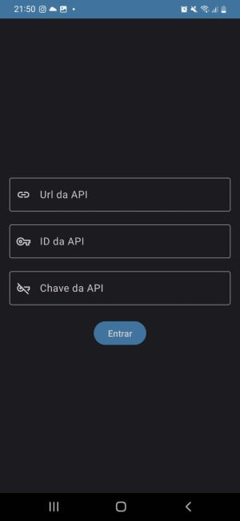
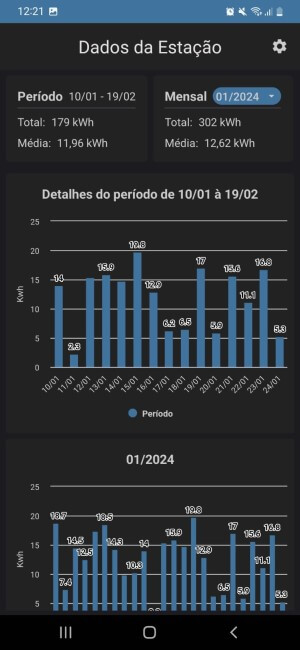
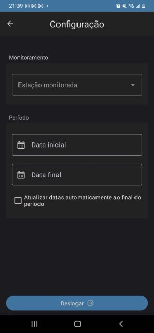
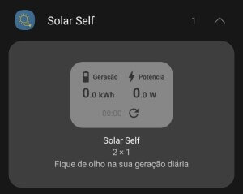

# Solar Self 🌞

### Sobre o App 📱
Este é um aplicativo desenvolvido em **Kotlin** para dispositivos **Android** e serve para fazer o monitoramento de alguns dados de estações de geração de energia solar que utilizam inversores da marca **[Solis](https://www.soliscloud.com/)**.

Atualmente está disponível os seguintes dados
- Widget com dados de carga em tempo real;
- Card e grágico de barra com a carga mensal, podendo selecionar o mês de referência;
- Card e gráfico de barra com a carga por período, podendo selecionar o período desejado para visualização dos dados.
  

### Como Usar 👉🏼📱
Este app utiliza a API de monitoramento do Solis Cloud.
Então, para utilizar o App você precisa de 3 informações de acesso à API da Solis Cloud que são:
- Url da API
- Id da API
- Chave da API

Estas informações ficam disponíveis dentro da sua conta na Solis Cloud, dentro do **Menu** de configurações na aba **Gerenciamento de API**  
  

Caso você não tenha acesso a este **menu**, basta abrir uma solicitação de acesso ao menu para o suporte do Solis Cloud em [Solis Cloud Support](https://solis-service.solisinverters.com/pt-BR/support/tickets)  
Feito isso dento do menu mencionado acima estará disponível para você ativar a API e ativando ela estará disponível as chaves de acesso para utilização no aplicativo. 
  

Feito isso e tendo essas informações em mão o acesso ao monitoramento atravéz do app já está concluido.
  

### Screenshots 📷
   